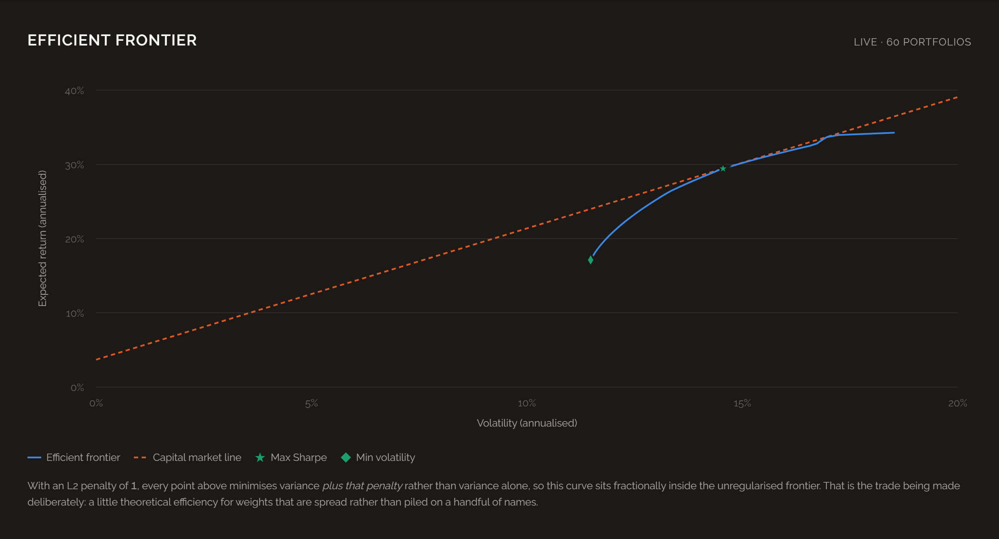
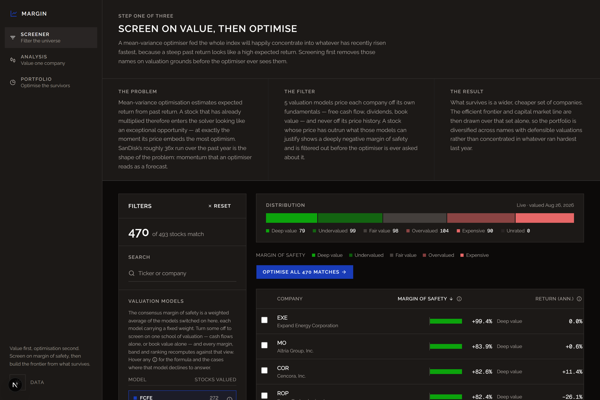
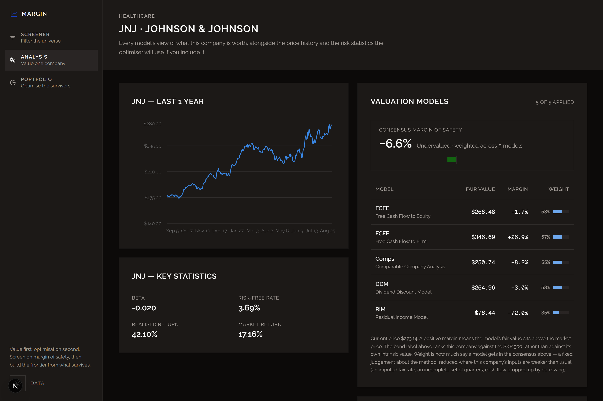
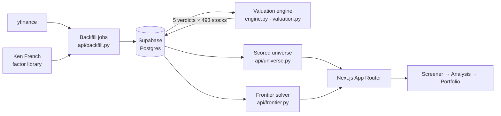
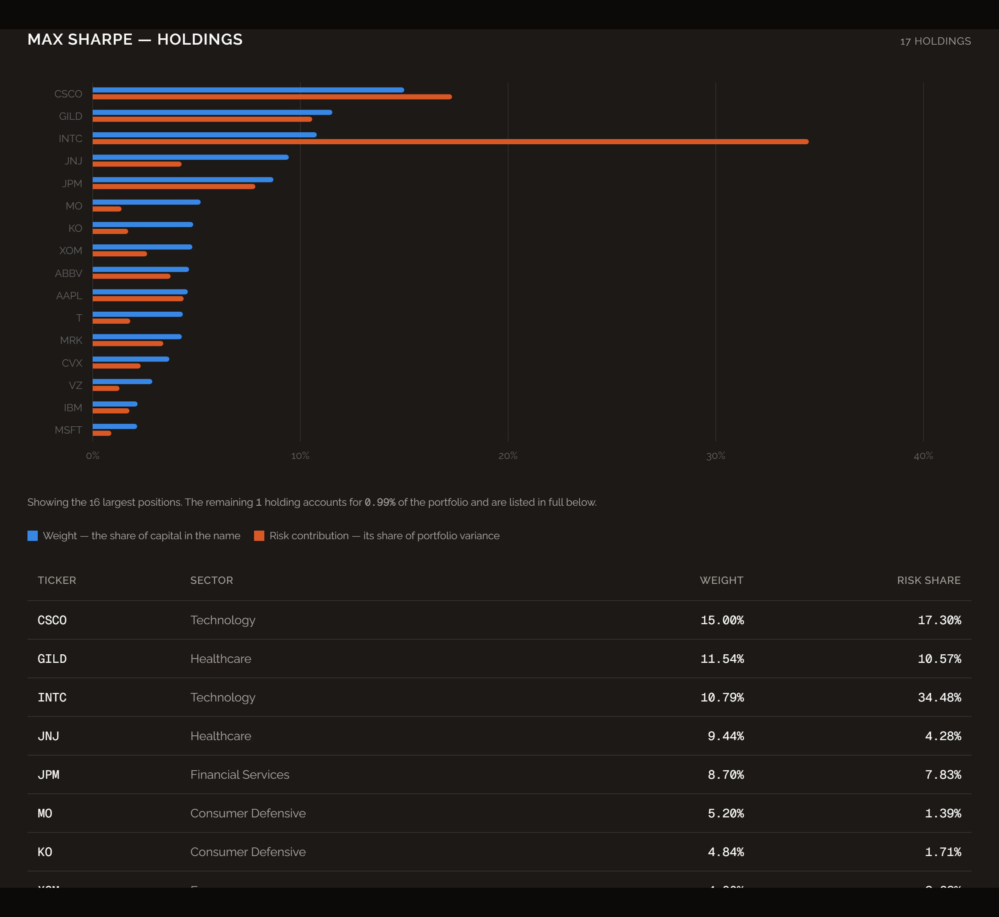

<div align="center">

# Margin

**Value the S&P 500 five ways, screen on the results, and build a mean-variance
optimal portfolio out of whatever survives.**

A full-stack quantitative finance dashboard — Next.js front end, FastAPI
solver service, Postgres warehouse.


</div>



---

## The idea in one paragraph

A mean-variance optimiser estimates expected return from *past* return, so a
stock that has already tripled enters the solver looking like an exceptional
opportunity — at exactly the moment its price embeds the most optimism. Margin
puts a valuation filter in front of the optimiser. Five models price each
company off its own fundamentals, the screener cuts the index down to names
trading below what those models justify, and only then is the frontier drawn.
The optimiser can allocate anywhere it likes, but only among companies that
already passed for value.

## What it does

| | Step | |
|---|---|---|
| **1** | **Screen** | 5 valuation models score all 493 companies. Filter on consensus margin of safety, sector, beta, coverage. Hand the survivors to step 3 with one click. |
| **2** | **Analyse** | Every model's verdict on one company, with the price history, CAPM statistics, and the exact discount rates each valuation used. |
| **3** | **Optimise** | Solve the efficient frontier over the screened set. Position bounds, short selling and L2 regularisation are all exposed — every figure on the page is downstream of them. |

<table>
<tr>
<td width="50%"></td>
<td width="50%"></td>
</tr>
<tr>
<td align="center"><em>Step 1 — screen the index on value</em></td>
<td align="center"><em>Step 2 — every model's verdict on one company</em></td>
</tr>
</table>

## What this project demonstrates

| Area | Where to look |
|---|---|
| **Convex optimisation** | [`api/frontier.py`](api/frontier.py) — the frontier is traced as N separately solved QPs under a shared constraint set, with the tangency portfolio located by ternary search |
| **Financial modelling** | [`api/valuation.py`](api/valuation.py) — FCFE, FCFF, DDM, RIM and comparables, each a pure function that returns `None` rather than a wrong number |
| **Numerical judgement** | Ledoit-Wolf covariance shrinkage, return clipping, feasibility checks that fire before the solver does |
| **Data engineering** | Incremental backfills over yfinance and the Ken French library into 13 Postgres migrations, with TTM rollups computed in SQL views |
| **Performance work** | One optimisation went from ~80s to ~2s: parallel paged reads, predicate pushdown, per-ticker caching |
| **Product thinking** | Every constraint the solver runs under is on the page next to the result, because a frontier with no stated constraints is not a claim about anything |
| **Testing** | A Playwright + HTTP sweep that drives the real UI across dozens of screened sets and asserts the frontier's structural invariants |

## Architecture



Two services. The Next.js app owns rendering and route handlers; the FastAPI
service owns everything numerical and every write to Postgres. They talk over
HTTP, so the solver can be deployed and scaled on its own — a 200-point
frontier is a CPU-bound job that has no business sharing a runtime with page
rendering.

Valuations are **precomputed into a table**, not derived on request. The models
themselves cost ~0.08s for the entire index; the bulk reads that feed them cost
~35s. Recomputing per request would pay a fixed toll for numbers that change
once a day.

## Four problems worth reading about

<details open>
<summary><b>The max-Sharpe portfolio that kept vanishing</b></summary>

<br>

`EfficientFrontier.max_sharpe()` re-parameterises the problem so that
`(μ − r_f)ᵀw = 1`. That has **no solution** whenever the constraints admit no
portfolio out-earning the risk-free rate — and here that was routine, not an
edge case: a value screen selects for weak trailing returns, and the per-stock
cap forces enough of them into the portfolio that its attainable return lands
under the T-bill rate. The solve failed outright and took the whole response
with it.

The fix inverts the order. The frontier is traced as N minimum-variance solves
at target returns, which is feasible anywhere inside the attainable range, and
the tangency portfolio is then *found* among the results rather than solved
for. It can no longer fail to exist: when nothing beats cash, the best Sharpe
is simply negative — a true statement about the screened set rather than a
crash. → [`trace_frontier`](api/frontier.py)

</details>

<details>
<summary><b>A URL is a header</b></summary>

<br>

Handing ~500 tickers to the portfolio page as `?tickers=A,AAPL,…` makes a 3KB
URL. Next echoes that URL into the request line, the `Next-Url` header **and**
`Referer`, so 3KB of URL spends ~9.2KB of Node's 16KB header budget — and
ordinary cookies push it over into `431 Request Header Fields Too Large`. The
page died for some readers and not others depending on what cookies they
happened to be carrying.

The screened set is a subset of a known, fixed universe, so it encodes as one
bit per constituent: 503 bits, 84 base64 characters, and selecting the whole
index costs the same as selecting one stock. The token carries a fingerprint of
the universe it was built against, so a link that predates an index change is
refused rather than silently decoded into a different portfolio.
→ [`lib/ticker-set.ts`](lib/ticker-set.ts)

The same bug then reappeared one layer down, in the fetch the page makes. The
durable fix was not a working click but an assertion: the test sweep fails if
the outgoing solve request exceeds 256 bytes, which catches the regression
while it still returns HTTP 200.

</details>

<details>
<summary><b>Infeasible before the solver ever sees it</b></summary>

<br>

A 3% per-stock cap sounds like a diversification rule. Combined with
`Σw = 1` it is also an arithmetic claim: `cap × n ≥ 1`, so a 3% cap silently
*requires* at least 34 holdings. The screener routinely hands over five. CVXPY
reports that as an opaque solver failure, which is useless to whoever typed the
number.

Bounds are now checked before any solve, and the error names the threshold
rather than the violation:

> A 1.00% maximum position cannot fill a portfolio of 19 stocks — the weights
> would sum to at most 19%. Raise it to at least 5.26%, or screen for fewer
> stocks.

→ [`resolve_constraints`](api/frontier.py)

</details>

<details>
<summary><b>Weight is not risk</b></summary>

<br>

A 3% position in a volatile, everything-correlated name can carry several times
the risk of a 3% position in a defensive one, and a weight table cannot show
it. The holdings chart plots each position's weight against its share of
portfolio variance, via the Euler decomposition `wᵢ(Σw)ᵢ / wᵀΣw` — exact rather
than approximate, because variance is homogeneous of degree two.

In the screenshot below, INTC is 11% of the capital and **35% of the risk**.
→ [`risk_contributions`](api/frontier.py)



</details>

## Quickstart

**Prerequisites:** Node 20+, pnpm, Python 3.12, and a free
[Supabase](https://supabase.com) project.

```bash
# 1. Front end
pnpm install
cp .env.example .env.local

# 2. Solver service
cd api
python -m venv .venv && .venv/Scripts/activate   # source .venv/bin/activate on macOS/Linux
pip install -r requirements.txt
cp .env.example .env                             # add your Supabase URL + service role key

# 3. Database
supabase link --project-ref <your-ref>
supabase db push                                 # applies supabase/migrations/
```

Run both services:

```bash
pnpm dev                                          # dashboard  → localhost:3000
cd api && uvicorn main:app --reload --port 8000   # solver     → localhost:8000
```

Then open [localhost:3000/data](http://localhost:3000/data) and press **Refresh
everything**. That runs every ingest stage in dependency order and recomputes
the valuations last — about 10 minutes cold. The dashboard is usable
immediately afterwards.

<details>
<summary>Refreshing from the terminal, and what each flag is for</summary>

<br>

```bash
# Daily shape — prices, factors, valuations. ~2 min.
curl -X POST "http://127.0.0.1:8000/backfill/all?skip_fundamentals=true"

# Everything, including quarterly statements. ~10 min.
curl -X POST "http://127.0.0.1:8000/backfill/all"

# Also re-pull the full 2-year price window.
curl -X POST "http://127.0.0.1:8000/backfill/all?full=true"
```

| flag | when |
|---|---|
| *(none)* | Full refresh including quarterly statements. Statements change once a quarter, so this is rarely the one you want. |
| `skip_fundamentals=true` | The daily shape. Prices change every session; statements do not. |
| `full=true` | Belt and braces after a ticker is added to `api/data/sp500_tickers.json`. |

Every stage is incremental and every write is an upsert, so re-running is safe
and cheap. The individual cards on `/data` are still there for when only one
table needs refreshing.

**Why `full=true` exists.** The incremental window comes from a single global
newest-date across the price table. That is right for a ticker tracked all
along and wrong for one that is not: a name added later would start from "five
days ago", land a handful of rows, and from then on *look* up to date — never
filling in the two years behind it. `/backfill/all` detects this on its own, so
the flag is a fallback rather than a requirement.

**A short history is not always a bug.** Recent spin-offs genuinely have less
history than the risk model wants. The optimiser needs 90% coverage of the
window to estimate a covariance and excludes names below that rather than
pricing risk they never showed.

</details>

## Shaping the optimisation

Every constraint the solver runs under is exposed on `/portfolio`, because
every number on that page is downstream of them.

| control | effect |
|---|---|
| **Maximum position** | Per-name cap. Blank scales it to the universe (see *Infeasible before the solver* above). |
| **Minimum position** | Floor on every weight. Positive forces every name in — the direct way to eliminate zero weights. Negative permits shorting to that depth. |
| **Allow short selling** | Shorthand for a floor at `−cap`. An explicit minimum overrides it, so an asymmetric range (−1% floor against a 5% cap) means what it says. |
| **L2 penalty (γ)** | Adds `γ‖w‖²` to the objective. |
| **Portfolios** | How many points are solved along the frontier. Each is its own optimisation, so this decides run time. |

<details>
<summary>What γ actually does, and where to watch for it</summary>

<br>

A box-constrained mean-variance solve puts its optimum on a **vertex** of the
feasible set: most weights land at exactly zero and the survivors at exactly
the cap, and nudging any input reshuffles which names those are. The L2 term is
strictly convex, so it pulls the solution off that vertex.

Its visible effect is at the **minimum-volatility end** of the frontier, not at
the tangency — the frontier is traced by minimising variance at a target
return, and at the max-Sharpe point that return constraint is doing the
binding. Over one 19-stock set, raising γ from 0 to 5 moved the min-volatility
portfolio from 10.6 to 19.0 effective holdings while the tangency went 6.8 →
7.2. The **Eff. names** column in the anchor table is where to watch it.

With γ above zero the plotted curve minimises variance *plus the penalty*, so
it sits fractionally inside the unregularised frontier. That is the trade being
made on purpose, and the chart says so.

</details>

## Testing

```bash
npx playwright install chromium

node .claude/skills/test-portfolio-optimizer/sweep.mjs --quick   # ~1 min
node .claude/skills/test-portfolio-optimizer/sweep.mjs           # full matrix
```

Sweeps the optimiser across many screened-set sizes and tilts, asserts the
frontier's structural invariants (monotone envelope, tangency at least as good
as every plotted point, capital market line genuinely tangent), drives the real
page in headless Chromium, and checks the outgoing request stays inside its
byte budget.

```bash
pnpm lint && pnpm build     # front end
```

## Project layout

```
app/                  Next.js App Router — pages and route handlers
  api/                server-side proxies to the solver service
components/           React components (charts, tables, controls)
lib/                  client logic: valuation types, URL codec, formatting
api/                  FastAPI solver service
  main.py             HTTP surface — routes only
  frontier.py         mean-variance optimisation
  valuation.py        the five models, as pure functions
  engine.py           runs every model across the universe
  backfill.py         ingest jobs, in dependency order
  market.py           price/return reads, with caching
  universe.py         the scored universe the screener consumes
  db.py               Supabase access, retries, paging
supabase/migrations/  schema, TTM rollups, risk-free-rate views
```

<details>
<summary><b>API reference</b></summary>

<br>

| endpoint | what |
|---|---|
| `GET /health` | liveness |
| `GET /quote/{ticker}` | latest price snapshot |
| `GET /info/{ticker}` | full yfinance info blob |
| `GET /history/{ticker}?period=1y&interval=1d` | OHLCV candles |
| `GET /returns/{ticker}` | 252 days of log returns, the 2×2 covariance matrix, and the annualised risk-free rate |
| `GET /valuations` | every model's verdict for every stock, precomputed |
| `POST /efficient-frontier` | solve the frontier — see below |
| `POST /backfill/all?full=&skip_fundamentals=` | **every stage, in order** |
| `POST /backfill/sp500-daily-close?full=` | daily closes |
| `POST /backfill/factor-returns` | Fama-French daily factors |
| `POST /backfill/quarterly-fundamentals` | statements, profile, dividends |
| `POST /backfill/company-profile` | profile fields only, a cheaper refresh |
| `POST /backfill/valuations` | recompute every model; run after any of the above |

```
POST /efficient-frontier
  ?tickers=AAPL,MSFT,…     screened subset; omit for the whole index
  &short_allowed=false
  &n_portfolios=100        2–200, each a separate solve
  &min_weight=-0.05        fraction, not percent; omit for auto
  &max_weight=0.15         fraction, not percent; omit to scale to the universe
  &gamma=1                 L2 penalty, 0–5
```

Returns the solved envelope, both anchor portfolios, the capital market line,
the risk decomposition of the tangency portfolio, and the constraints that were
*actually* applied — which is not always what was asked for, since a small
screened set forces the cap to widen.

</details>

## Deployment

The two services deploy independently.

- **Dashboard** → Vercel. Set `MARKET_DATA_API_URL` to the deployed solver.
  A 200-point solve can exceed a serverless function's default limit;
  `maxDuration` is already set to 300s on the frontier route.
- **Solver** → any container host. [`api/Dockerfile`](api/Dockerfile) is
  included; set `SUPABASE_URL`, `SUPABASE_SERVICE_ROLE_KEY` and
  `ALLOWED_ORIGINS` (comma-separated) in the environment.
- **Database** → Supabase. `supabase db push` applies the migrations.

The service role key bypasses row-level security and must never reach the
browser. It is read only by the Python service, which is why the backfills live
there rather than in a Next.js route handler.

## Limitations

Worth stating plainly, since the numbers look authoritative:

- **Expected returns come from a 2-year trailing mean.** That is the standard
  weakness of mean-variance optimisation and the reason the value screen exists
  in front of it. Returns are clipped to ±50% so no single estimate can run
  away with the allocation, but a bull window still reads optimistically.
- **The screener's bands are relative, not absolute.** "Deep value" means
  *cheapest fifth of the index*, not *below intrinsic worth*. The UI says so
  wherever a band is named.
- **Fundamentals come from yfinance**, which is an unofficial API with real
  gaps. Models return no verdict rather than a guess when an input is missing,
  so coverage varies by company and is worth filtering on.
- **Not investment advice.** This is a portfolio project built to exercise the
  modelling and engineering, not to allocate money.

## Licence

MIT.
